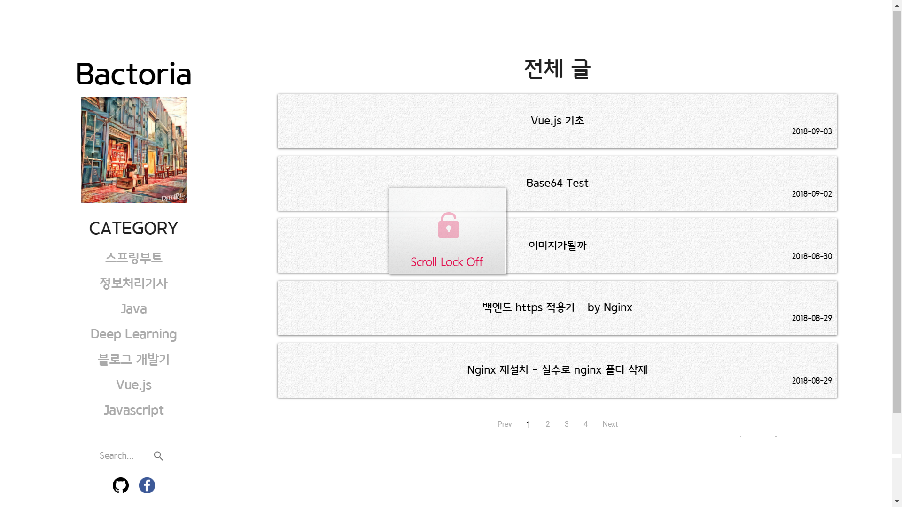
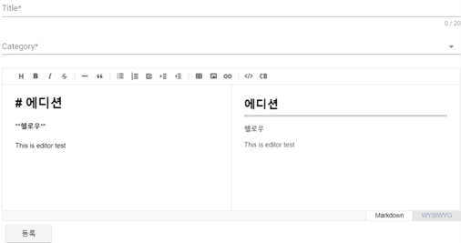
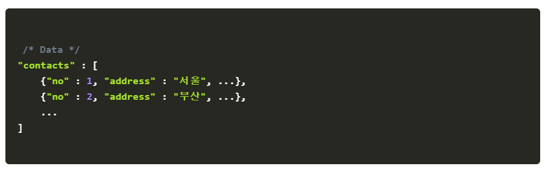

# FrontEnd - [Bactoria.me](https://bactoria.me) 

 
 

### `Used Library`

**1. Framework** : Nuxt.js

 

**2. editor** : [tui-editor](https://github.com/nhnent/tui.editor)

 

**3. paging** : [vuejs-paginate](https://github.com/lokyoung/vuejs-paginate) 

 

**4. markdown** : [vue-markdown](https://github.com/miaolz123/vue-markdown)

 

**5. codeBlock** : [Prismjs](https://prismjs.com/)

 
 

### `BackEnd Repository` (Spring Boot)

https://github.com/bactoria/ToyProject-Blog-REST
